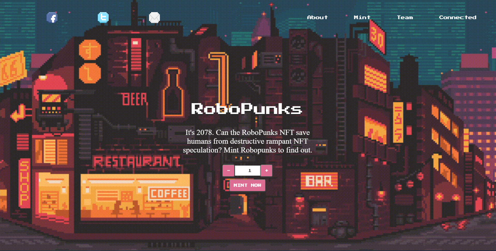

# The Full Minty

For full functionality (purchasing your NFTs) please download metamask at the following link. https://metamask.io/download/

You can receive free tokens to use by going to the following link https://rinkebyfaucet.com/
Simply enter in your desired rinkeby wallet address to send the tokens to.

This project is created using a React framework and allows the user to mint RoboPunk NFTs. Start by connecting your wallet by clicking "connect". Select how many NFTs you would like to mint (between 1 and 3) and click MINT NOW. You will receive a prompt from your wallet to confirm the charge. Once the charge is confirmed you will see the transaction complete for your Mint.

The app utilizes React, Metamask, rinkeby test network, Ethers, ChakraUI, and OpenZeppelin. For smart contract testing Hardhat (https://github.com/nomiclabs/hardhat) was utilized.

Check it out at the following link: 

